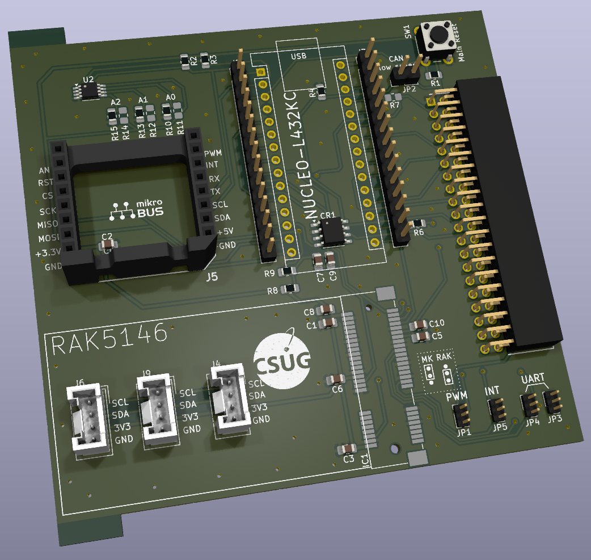

# **Carte Communication INISAT L432KC**
Cette carte a pour but de fonctionner comme un OBC qui peut se relier à l'environnement Inisat grace au header standardisé. 

Cette carte peut accueillir un module MikroBus, des modules Grove et une gateway LoRa RAK156.

Elle peut également être utilisée comme une carte Thingsat.

Voici les deux versions de la carte:

**Carte com inisat avec connecteur mini-PCI-Express (pour accueillir un concentrateur LoRa)**

**Carte com inisat avec connecteur Grove**

## Description de la carte
La carte est equipée de:

 - Un emplacement pour carte **Nucleo-32** (ou arduino nano)
 - Un emplacement **MikroBus**
 - Un connecteur **mini-PCI-Express** OU 3 connecteurs **Grove** I2C (en fonction de la version de la carte)
 - Un connecteur **Inisat** (pour se raccorder aux autres cartes de l'ecosystème Inisat)
 - Un **transceiver CAN** ([L9616](https://www.st.com/en/automotive-analog-and-power/l9616.html) - STMicroelectronics)
 - Un **capteur de température** I2C ([MCP9808](https://www.microchip.com/en-us/product/mcp9808#document-table) - Microchip)

## Nucleo 32 (L432KC)

## Emplacement MikroBus

## mini PCI Express

## Jumpers de selection des signaux
Les signaux marqués d'une étoile sur les diagrammes sont partagées entre plusieurs empreintes.
Pour pouvoir utiliser ces signaux il faut donc les "router" vers l'emplacement dont on veut se servir en plaçant correctement les jumpers en bas à droite de la carte.

- PWM1 : 
	- position haute: PWM Mikrobus 		(pin 8 de l'empreinte Mikrobus)
	- position basse: PWM Inisat 		(pin 6 du connecteur Inisat)
	
- INT :
	- position haute: INT Mikrobus 		(pin 7 de l'empreinte Mikrobus)
	- position basse: PPS Lora core 	(pin 19 du connecteur mini PCI Express)
	
- UART (Rx et Tx) :
	- position haute: UART Mikrobus 	(pin 5 et 6 de l'empreinte Mikrobus)
	- position basse: UART GPS Lora core (pin 31 et 33 du connecteur mini PCI Express)

	
## Transceiver CAN
Le transceiver CAN peut être configuré pour opérations à hautes vitesses (> 250KBaud/s) ou à basse vitesse (< 250KBaud/s).
Pour positionner le transceiver en mode haute vitesse, il faut placer un jumper sur le connecteur JP2.

## Capteur de température
L'adresse i2c du capteur de température est définie comme suit : 0b 0 0 1 1 A2 A1 A0

les bits de poids faibles A2,A1 et A0 sont définis en plaçant des résistances 0 Ohms (_il ne faut donc placer qu'une seule résistance pour chaque bit_): 
 

## Modularité de la carte
Les références marquées d'une étoile sur la sérigraphie ne doivent pas necessairement être montées. Voici les composants concernés:

* Alimentation Nucleo (R6 et R7)
	* R7: alimentation de la nucleo en 5V
	* R6: alimentation de la nucleo en 3.3V
* Alimentation Transceiver CAN (R8 et R9)
	* R9: alimentation L9616 en 5V
	* R8: alimentation L9616 en 3.3V
* Selection adresse i2c capteur de temperature (R10-R15)
	* [voir ci-dessus](##capteur-de-temperature)

# Contributeurs
* **Design PCB** Vincent Grennerat Vincent.Grennerat@univ-grenoble-alpes.fr
* **Design PCB** Léo CORDIER leo.cordier@univ-grenoble-alpes.fr 
* **Design PCB** Vincent Grennerat Vincent.Grennerat@univ-grenoble-alpes.fr
* **Programmation embarquée** Didier Donsez didier.donsez@univ-grenoble-alpes.fr

