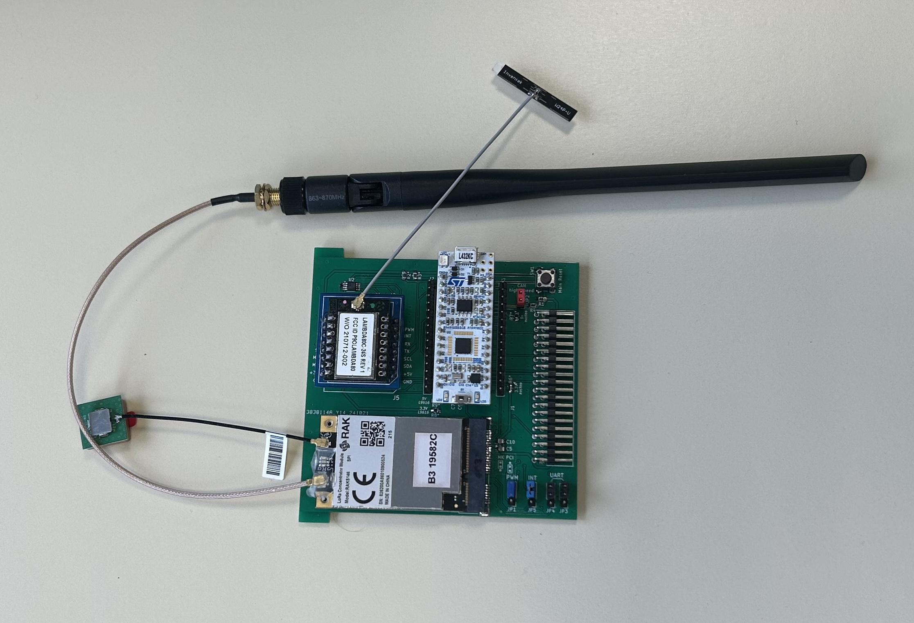
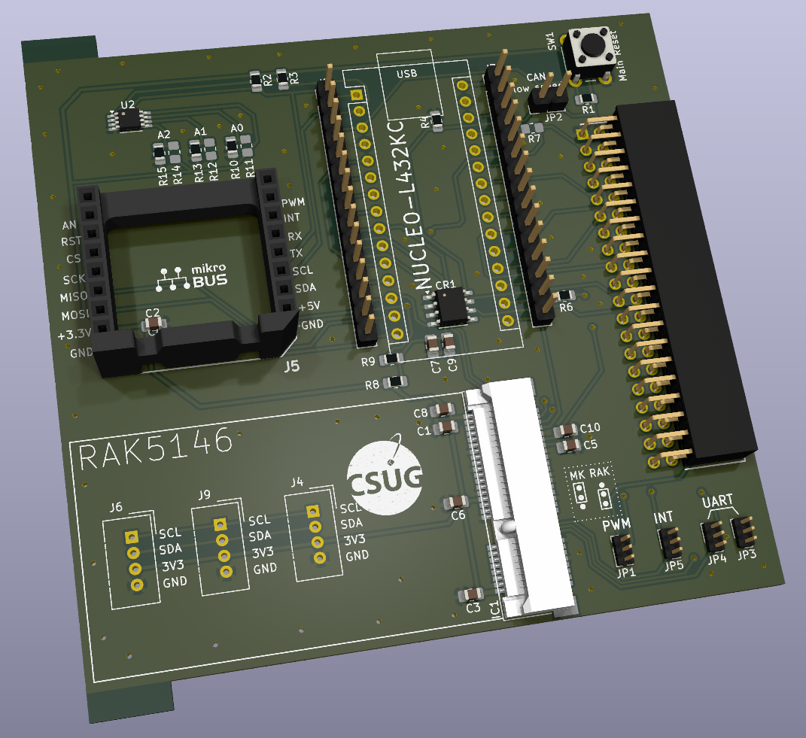
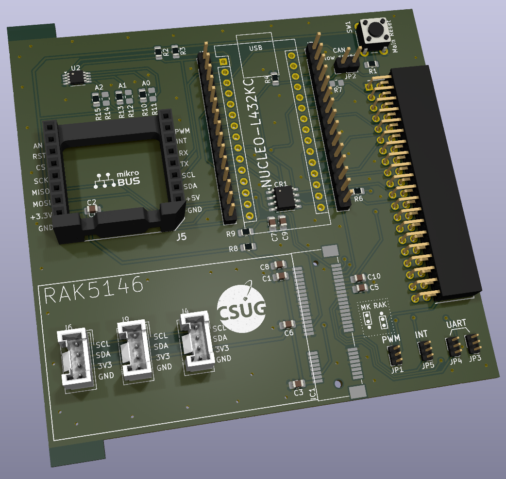
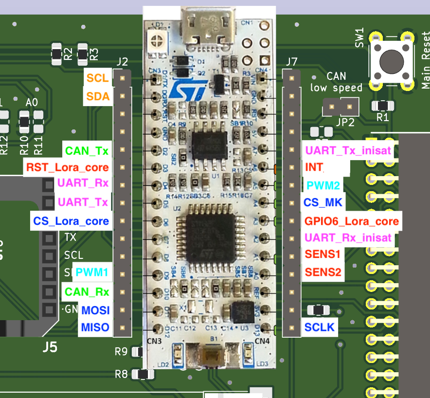
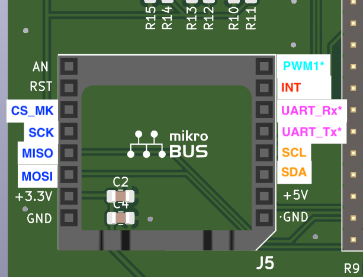
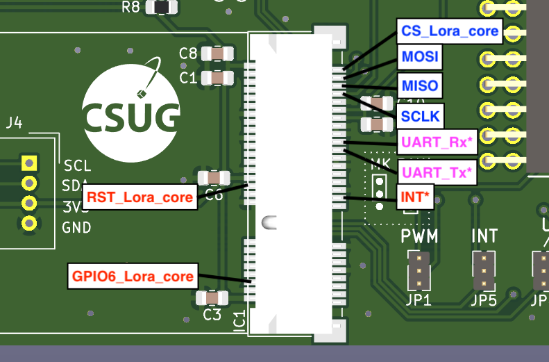
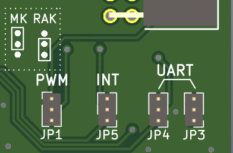
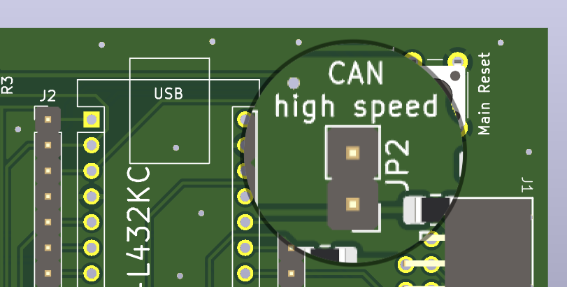
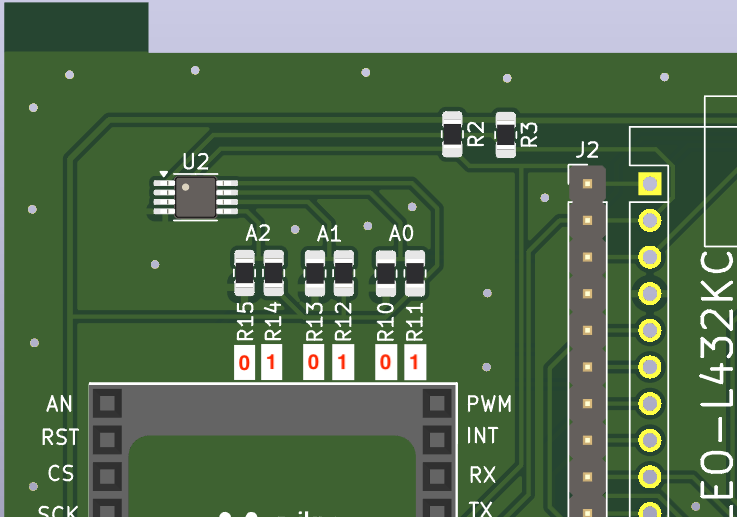

# **Carte Thingsat @ INISAT 📡 🚀 : OBC + Communication avec Nucleo L432KC + Gateway RAK5146**

La carte [Thingsat](https://gricad-gitlab.univ-grenoble-alpes.fr/thingsat/public/-/blob/master/README.md?ref_type=heads) @ INISAT a pour but de fonctionner comme un OBC qui peut se relier à l'environnement INISAT grace au header standardisé. 

Cette carte fonctionne également comme une carte de communication avancée LoRa/FSK avec l'ajout d'un module [gateway LoRa (+ GNSS) au format mini-PCIe](https://www.mikroe.com/mikrobus) comme le module [RAK5146](../../sx1302_modules).

> Remarque: D'autres modules gateways LoRa avec ou sans module GNSS sont compatibles avec la carte. Voir la [liste](../../sx1302_modules).

Cette carte peut accueillir un module MikroBus qui peut accueillir des platines de l'[écosystème Mikrobus](https://www.mikroe.com/mikrobus).

Cette carte peut accueillir trois platines Grove I2C/UART situés sous le module mini-PCIe.

La carte [Thingsat](https://gricad-gitlab.univ-grenoble-alpes.fr/thingsat/public/-/blob/master/README.md?ref_type=heads) @ INISAT peut être utilisée seule (standalone) pour des expérimentations à bord de [ballons stratosphériques](https://gricad-gitlab.univ-grenoble-alpes.fr/thingsat/public/-/blob/master/balloons/README.md).

## Schématique

[Schematic](schematic.pdf)

## Firmware

Le firmware avec RIOT OS est disponible [ici](../../Software/riot).

Le firmware avec [ici](../../Software/arduino) est à l'étude.

## Montages

La carte peut être montée en deux versions:

**Carte avec 1 connecteur mini-PCI-Express (pour accueillir un concentrateur LoRa) et 1 support Mikrobus**

**Carte avec 3 connecteurs Grove et 1 support Mikrobus**

## OpenLog

Pour journaliser la console d'exécution du firmware de la carte Nucleo L432KC, vous pouvez ajouter une [platine OpenLog](https://github.com/CampusIoT/tutorial/tree/master/openlogger) sur les headers externes de la carte.

| OpenLog | Nucleo L432KC |
| ------- | ------------- |
| `3V3` | `3V3` (et non `VIN`) |
| `GND` | `GND` |
| `RXI` | `A7` (aka `UART2_TX`) | 

> NB: il est recommandé que le port console soit configuré à 9600 bauds pour éviter la perte de caratères lors de l'écriture sur la carte SD. Pour les firmwares avec RIOT OS, il faut redéfinir dans le Makefile `STDIO_UART_BAUDRATE` avec `CFLAGS += -DSTDIO_UART_BAUDRATE=9600`

## Description de la carte
La carte est equipée de:

 - Un emplacement pour carte **Nucleo-32** (ou arduino nano)
 - Un emplacement **MikroBus**
 - Un connecteur **mini-PCI-Express** OU 3 connecteurs **Grove** I2C (en fonction de la version de la carte)
 - Un connecteur **Inisat** (pour se raccorder aux autres cartes de l'ecosystème Inisat)
 - Un **transceiver CAN** ([L9616](https://www.st.com/en/automotive-analog-and-power/l9616.html) - STMicroelectronics)
 - Un **capteur de température** I2C ([MCP9808](https://www.microchip.com/en-us/product/mcp9808#document-table) - Microchip)

## Nucleo 32 (L432KC)

## Emplacement MikroBus

## Connecteur mini PCI Express

Modules SX1302/3 compatibles: 
* [x] RAK5146 Gateway Concentrator Module for LoRaWAN SPI
* [ ] RAK2287 WisLink LPWAN Concentrator SPI (to test)
* [ ] RAK5166 WisLink LPWAN Concentrator SPI (to test)
* [x] Nebra NBR-0094
* [ ] Seeedstudio Wio-WM1302 Long Range Gateway Module  (to test)
* [ ] Seeedstudio Wio-WM1303 Long Range Gateway Module  (to test)
* [ ] Heltec HT1303  (to test)

## Jumpers de selection des signaux

Les signaux marqués d'une étoile sur les diagrammes sont partagées entre plusieurs empreintes.
Pour pouvoir utiliser ces signaux il faut donc les "router" vers l'emplacement dont on veut se servir en plaçant correctement les jumpers en bas à droite de la carte.

- PWM1 : 
	- position haute: `PWM Mikrobus` 	(pin 8 de l'empreinte Mikrobus)
	- position basse: `PWM Inisat` 		(pin 6 du connecteur Inisat)
	
- INT :
	- position haute: `INT Mikrobus` 	(pin 7 de l'empreinte Mikrobus)
	- position basse: `PPS Lora core` 	(pin 19 du connecteur mini PCI Express)
	
- UART (Rx et Tx) :
	- position haute: `UART Mikrobus` 	(pin 5 et 6 de l'empreinte Mikrobus)
	- position basse: `UART GPS Lora core` (pin 31 et 33 du connecteur mini PCI Express)

	
## Transceiver CAN

Le transceiver CAN peut être configuré pour opérations à hautes vitesses (> 250KBaud/s) ou à basse vitesse (< 250KBaud/s).
Pour positionner le transceiver en mode haute vitesse, il faut placer un jumper sur le connecteur `JP2`.

## Capteur de temperature [MPC9808](https://www.microchip.com/en-us/product/mcp9808#document-table)

L'adresse i2c du capteur de température est définie comme suit : `0b 0 0 1 1 A2 A1 A0`
les bits de poids faibles A2,A1 et A0 sont définis en plaçant des résistances 0 Ohms (_il ne faut donc placer qu'une seule résistance pour chaque bit_): 
 

## Modularité de la carte

Les composants entourés d'un rectangle en pointillé ne doivent pas necessairement être montées. Cela dépend de l'usage de la carte. Voici les composants concernés:

* Alimentation Nucleo
	* `R7`: alimentation de la nucleo en 5V (_nécessaire si la carte Inisat est utilisé seule **ET** que l'on a besoin d'utiliser le 5V pour le Mikrobus_)
	* `R6`: alimentation de la nucleo en 3.3V (_nécessaire si la carte Inisat est utilisé seule_)
* Alimentation Transceiver CAN
	* `R9`: alimentation L9616 en 5V
	* `R8`: alimentation L9616 en 3.3V (_par défaut_)
* Selection adresse i2c capteur de temperature (`R10`-`R15`)
	* [voir ci-dessus](#capteur-de-temperature)

# Contributeurs

* Léo CORDIER (Design PCB + montage)
* Vincent Grennerat (Design PCB)
* Didier Donsez (firmware de test)
* [Lucas ORLANDO BERNARDES](https://www.linkedin.com/in/lucas-orlando-bernardes-1b7397256/) (initial design)
