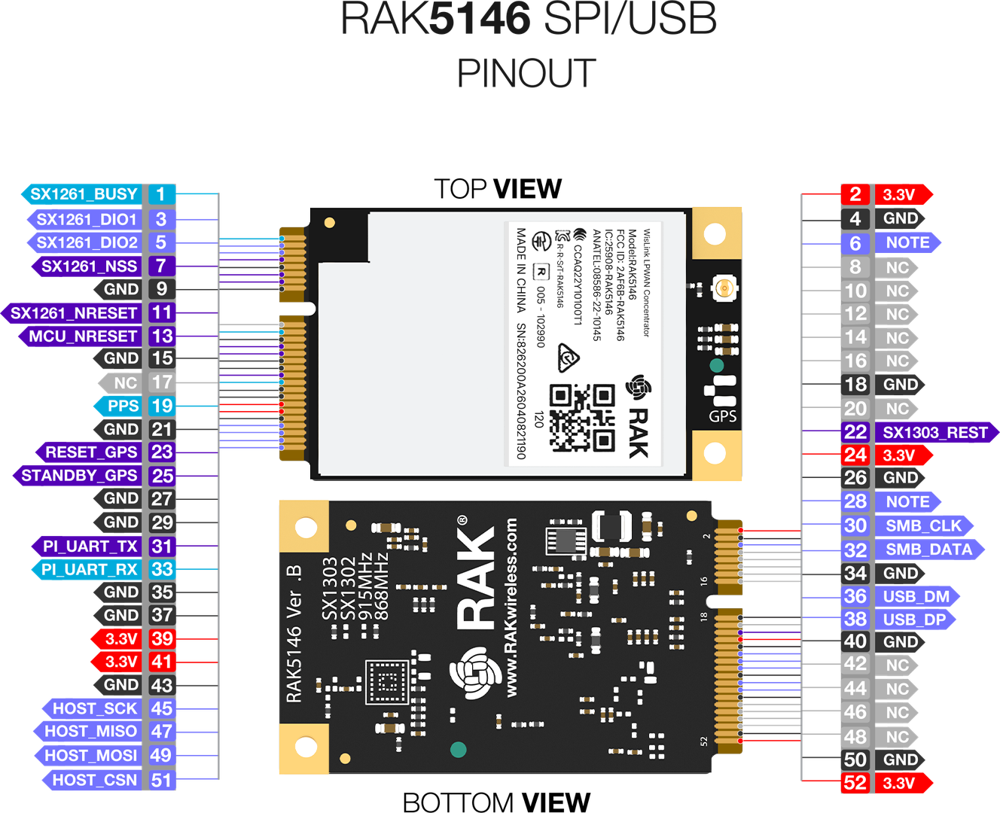
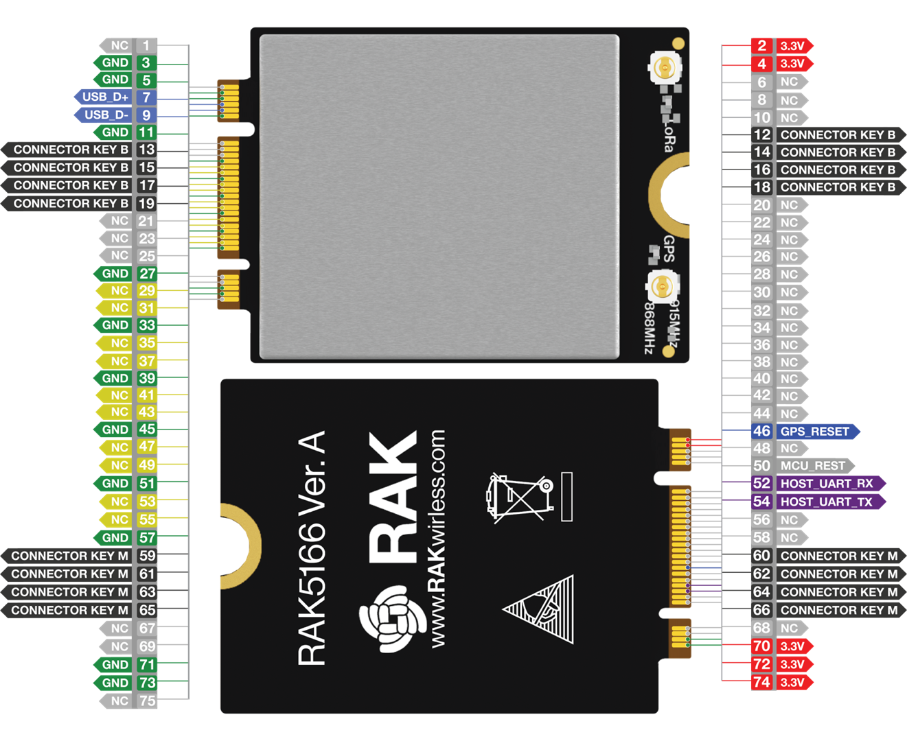
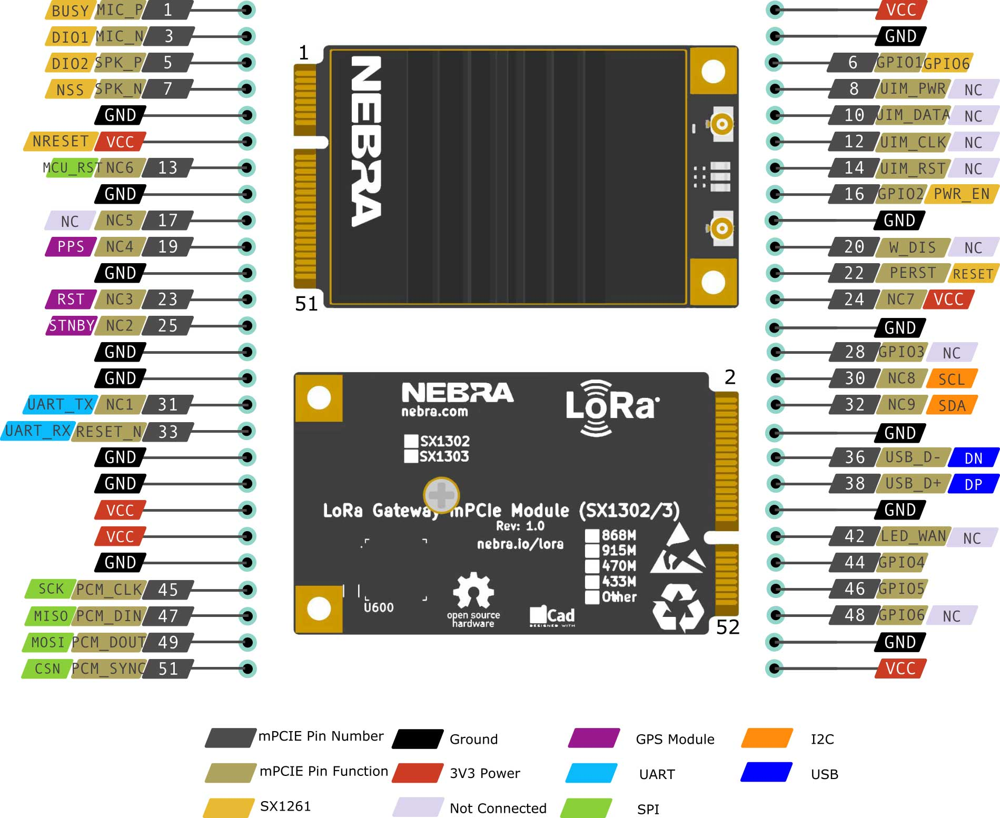
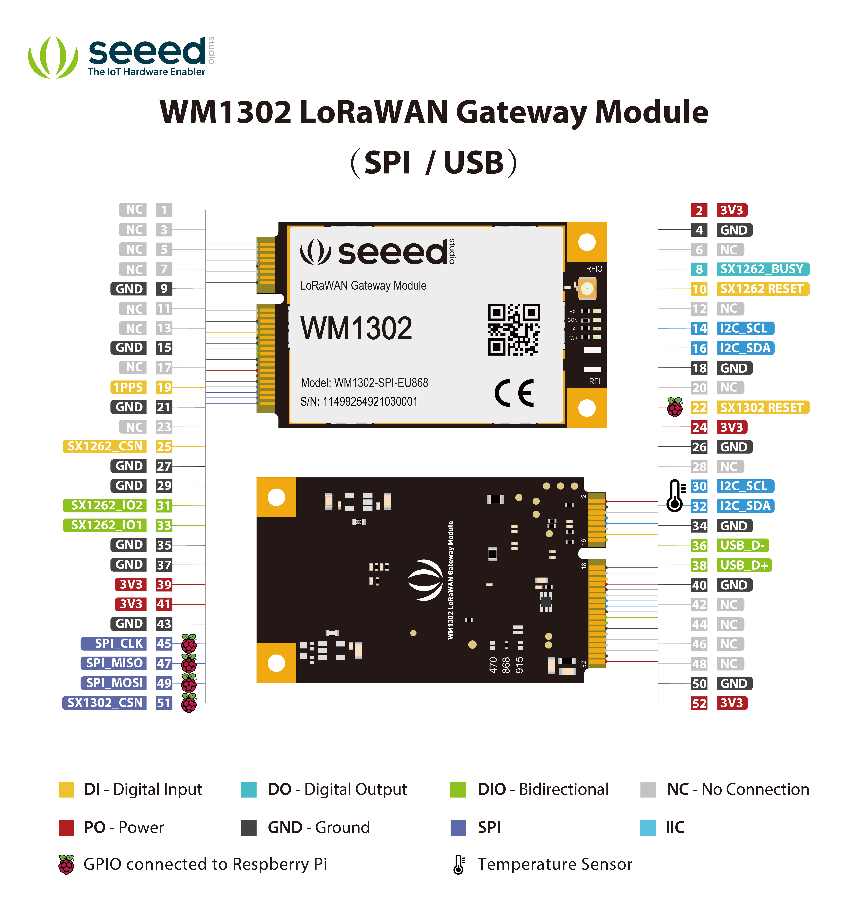
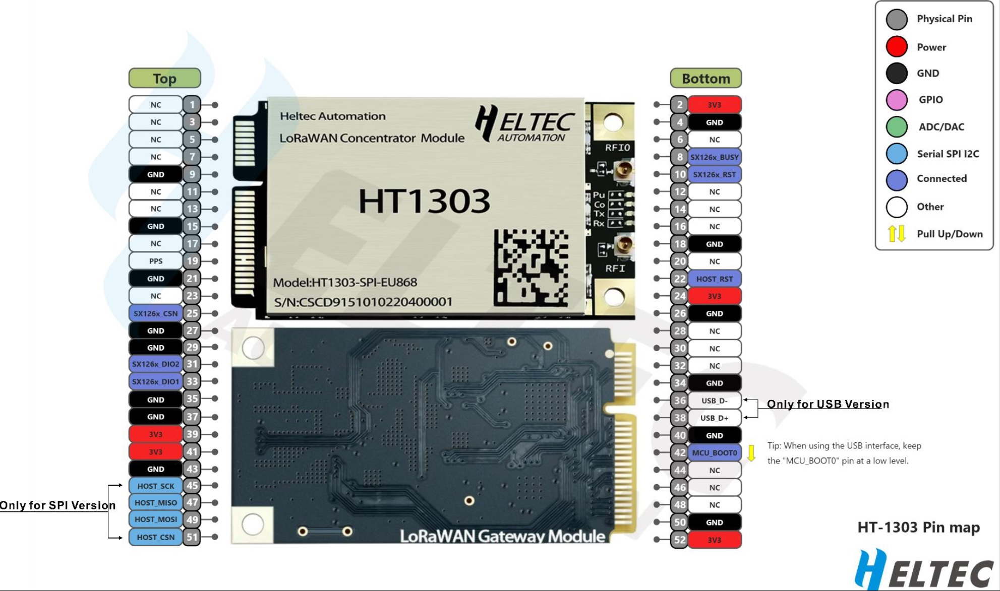
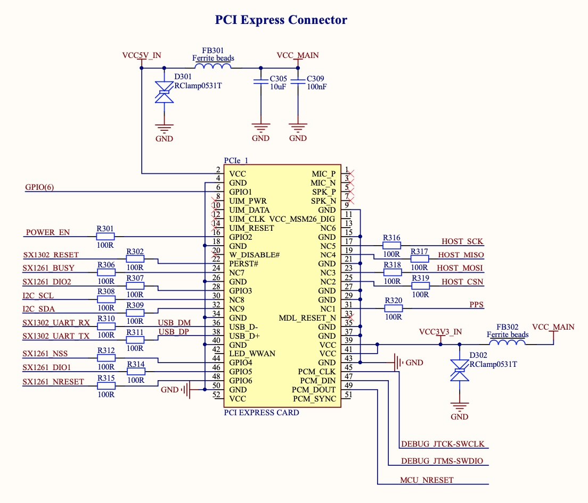

# SX1302 / SX1303 Gateway Modules for [2U-PCB-Com_Nucleo-L432KC](../2U-PCB-Com_Nucleo-L432KC)

## RAK5146 Gateway Concentrator Module for LoRaWAN SPI

* Manufacturer: [RAK Wireless](https://store.rakwireless.com/products/wislink-concentrator-module-sx1303-rak5146-lorawan?srsltid=AfmBOorAl43FJtvq0f6k6GQTX6-MeB1SWc8eSZecXvENYsJIkCYQmvOO&variant=39667784908998)
* Interface: mini-PCIe
* Bus: SPI (exists with USB interface with SX1261 for LBT)
* Chip: SX1303 + 2x SX1250
* Temperature: No
* GNSS: Yes UBlox UBlox ZOE-M8Q (UART)
* PPS: Yes
* LBT: Yes (for USB)
* Regions: EU868, IN865, US915, AS923, KR920, AU915. (RAK5146L supports CN470 or EU433)
* Compliance with [2U-PCB-Com_Nucleo-L432KC](../2U-PCB-Com_Nucleo-L432KC) : Yes

## RAK5166 WisLink LPWAN Concentrator SPI

* Manufacturer: [RAK Wireless](https://docs.rakwireless.com/product-categories/wislink/rak5166/overview)
* Interface: PCI Express M.2 Type 3042 andKey B-M Dual Key IDs
* Bus: SPI
* Chip: SX1303 + 2x SX1250
* Temperature: No
* GNSS: Yes UBlox ZOE-M8Q (UART)
* PPS: Yes
* LBT: Yes
* Regions: EU868
* Compliance with [2U-PCB-Com_Nucleo-L432KC](../2U-PCB-Com_Nucleo-L432KC) : No

## Nebra NBR-0094

* Manufacturer: [Nebra](https://support.nebra.com/support/solutions/articles/24000078841-nebra-sx1302-3-concentrator-module)
* Interface: mini-PCIe
* Chip: SX1303 + 2x SX1250 + SX1261 (rx only)
* Temperature: NA
* GNSS: No
* PPS: No
* LBT: No
* Regions: EU868
* Compliance with [2U-PCB-Com_Nucleo-L432KC](../2U-PCB-Com_Nucleo-L432KC) : Yes

## Seeedstudio Wio-WM1302 Long Range Gateway Module

* Manufacturer: [Seeedstudio](https://www.seeedstudio.com/WM1302-LoRaWAN-Gateway-Module-SPI-EU868-p-4889.html
)
* Interface: mini-PCIe
* Chip: SX1303 + 2x SX1250 + SX1261 (rx only)
* Temperature: NA
* GNSS: NA
* PPS: NA
* LBT: NA
* Regions: EU868
* Compliance with [2U-PCB-Com_Nucleo-L432KC](../2U-PCB-Com_Nucleo-L432KC) : Probably

## Seeedstudio Wio-WM1303 Long Range Gateway Module

* Manufacturer: [Seeedstudio](https://wiki.seeedstudio.com/Network/SenseCAP_Network/SenseCAP_M1-Helium_gateway/SenseCAP_M1_Overview/)
* Interface: mini-PCIe
* Chip: SX1303 + 2x SX1250 + SX1261 (rx only)
* Temperature: NA
* GNSS: NA
* PPS: NA
* LBT: NA
* Regions: EU868
* Compliance with [2U-PCB-Com_Nucleo-L432KC](../2U-PCB-Com_Nucleo-L432KC) : Probably
* Remark: only available into [Seeedstudio SenseCAP M1 Helium Miner](https://wiki.seeedstudio.com/Network/SenseCAP_Network/SenseCAP_M1-Helium_gateway/SenseCAP_M1_Overview/)

## Heltec HT1303

* Manufacturer: [heltec](https://heltec.org/project/ht1303/)
* Interface: mini-PCIe
* Bus: SPI (or USB))
* Chip: SX1302 + 2x SX1250
* Temperature: Unknown
* GNSS: No
* PPS: No
* LBT: No
* Regions: EU868
* Compliance with [2U-PCB-Com_Nucleo-L432KC](../2U-PCB-Com_Nucleo-L432KC) : Probably

##  Semtech SX1302C868GW1 Corecell Devkit

* Manufacturer: [Semtech](https://www.semtech.fr/products/wireless-rf/lora-core/sx1302cssxxxgw1)
* Interface: mini-PCIe
* Bus: SPI
* Chip: SX1302 + 2x SX1250
* Temperature: Yes (STTS751)
* GNSS: No (but slot available on connection board)
* PPS: No (but slot available on connection board)
* Regions: EU868
* Compliance with [2U-PCB-Com_Nucleo-L432KC](../2U-PCB-Com_Nucleo-L432KC) : No

