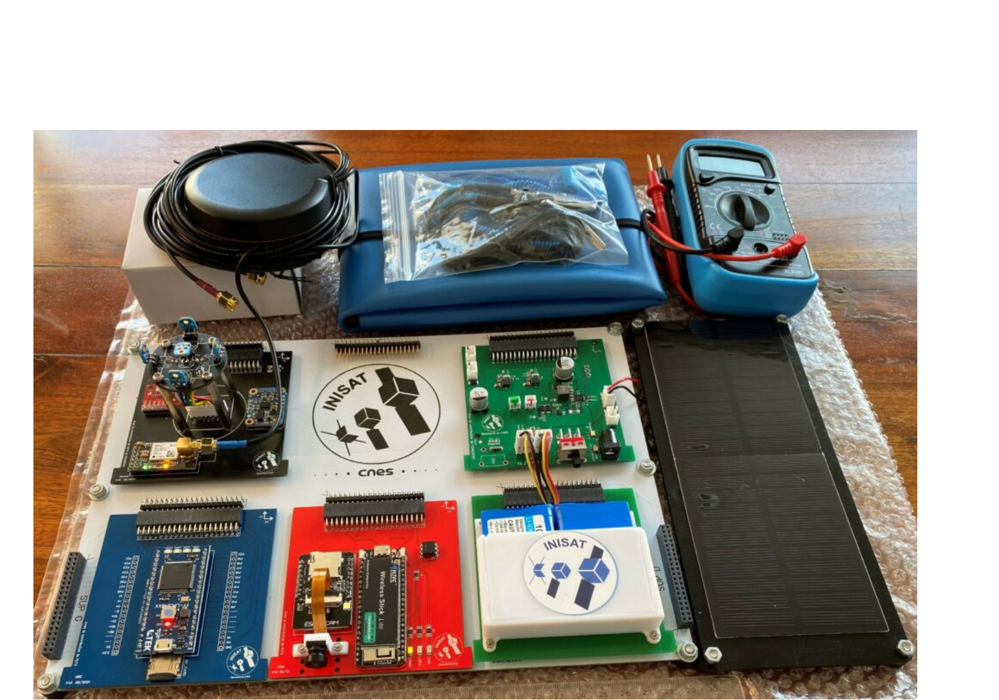
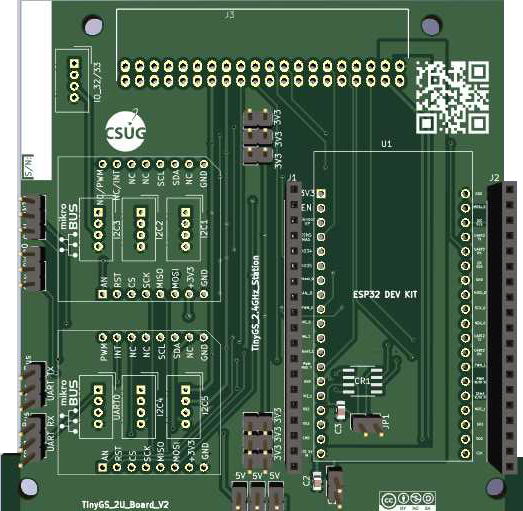

# Easy-Space Flatsat extensions

Extensions to [Easy Space](https://www.easy-space.fr/) INISAT flatsat mockup

## Board #1 OBC + LoRa Gateway + CAN Bus

* 1x [ST Nucleo L432KC](https://www.st.com/en/evaluation-tools/nucleo-l432kc.html)
* 1x [RAK Wireless RAK5146 (all bands)](https://store.rakwireless.com/products/wislink-concentrator-module-sx1303-rak5146-lorawan?_pos=1&_sid=c9dc2f56d&_ss=r&variant=39667784908998)
* 3x [Groove connectors](https://wiki.seeedstudio.com/Grove_System/)
* 1x [ST L9616 Automotive High Speed Can Bus Transceiver](https://www.st.com/en/automotive-analog-and-power/l9616.html)
  

## Board #2 ESP32 TinyGS

* 1x [ESP32 Wroom](https://www.espressif.com/en/products/devkits)
* 2x Mikrobus Slots for homebrew LoRa click boards (Lambda80, RN2483) or [others click boards](https://www.mikroe.com/shop)
* 6x [Groove connectors](https://wiki.seeedstudio.com/Grove_System/)
* 1x [ST L9616 Automotive High Speed Can Bus Transceiver](https://www.st.com/en/automotive-analog-and-power/l9616.html)

See [TinyGS 2G4 Station](https://github.com/thingsat/tinygs_2g4station)

## References

* [EasySpace Diffusion](https://github.com/EasySpace-Diffusion)
* [TinyGS 2G4 Station](https://github.com/thingsat/tinygs_2g4station)
