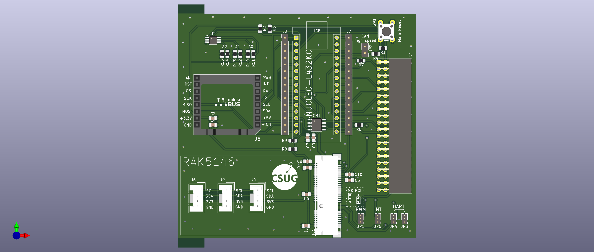

# INISAT 📡 🚀 Nucleo L432KC + RAK 5146 :: Firmwares with [RIOT OS](https://github.com/RIOT-OS/RIOT)

* [Installation et configuration](install.md)
* [Fonctionnalités de base de RIOT](basics.md)
* [Communications sur la carte INISAT Nucleo L432KC + RAK 5146](comm.md)
* [Capteurs](sensors.md)
* [Misc](misc.md)

